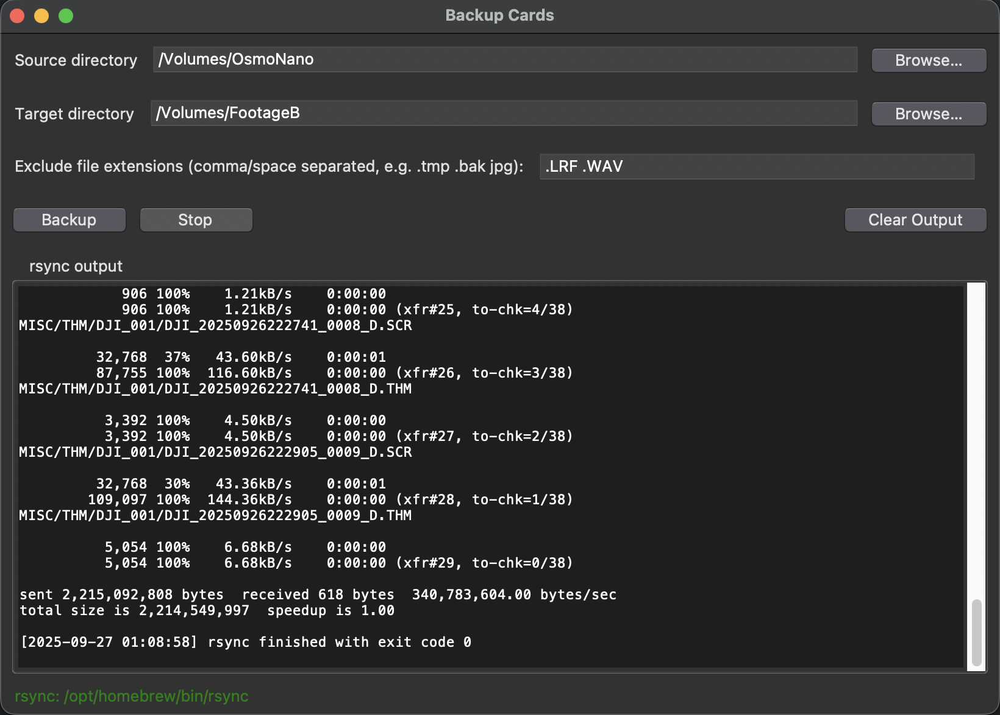

# Backup Cards

A NiceGUI-based macOS-friendly interface for running `rsync` backups.

- Select a source and target directory
- Optionally exclude files by extension (case-insensitive)
- See live `rsync` output while copying
- Remembers your last settings between launches

## Screenshot



## Requirements
- Python 3.12+
- [`nicegui`](https://nicegui.io/) (installed automatically via `uv sync`)
- [`pywebview`](https://pywebview.flowrl.com/) (installed automatically; powers the native window)
- `rsync` available on PATH
  - macOS ships an older `rsync`. For best performance/features, install via Homebrew:
    - Apple Silicon: `brew install rsync` (usually `/opt/homebrew/bin/rsync`)
    - Intel: `brew install rsync` (usually `/usr/local/bin/rsync`)

## Run (development)
Using `uv` (recommended):

```bash
uv sync
uv run python3 main.py
```

The UI runs in a native pywebview window (no external browser required). NiceGUI automatically picks an open port for the embedded server.

or with Just:

```bash
# If needed: brew install just
just setup
just run
```

## Build a macOS .app
Build with PyInstaller (already configured by `justfile`):

```bash
just build
# Result: dist/Backup Cards.app
just open-app
```

Equivalent raw command:

```bash
uv run pyinstaller --windowed --name "Backup Cards" \
  --osx-bundle-identifier com.example.backupcards \
  --add-data "README.md:README.md" \
  main.py
```

First launch may be blocked by Gatekeeper. Right-click the app → Open to bypass.

## Features & usage notes
- Exclusion extensions field accepts tokens like `.tmp .bak jpg`. Dots are optional.
- Exclusion is case-insensitive. Example input `jpg` produces `*.[jJ][pP][gG]`.
- The app copies the contents of the source directory (uses a trailing slash) into the target.
- Live output is streamed from `rsync`'s stdout.
- Directory pickers are implemented with a simple in-app browser so no additional native toolkits are required.
- Native mode uses `pywebview`, so the app behaves like a desktop application rather than a website.

## Settings persistence
Settings are stored in a per-user config file:

- Path: `~/Library/Application Support/Backup Cards/config.json`
- Saved fields: `source`, `target`, `exclude_exts`
- Auto-saves on field change (debounced) and on shutdown

## Troubleshooting
- "rsync not found": install Homebrew `rsync` or ensure it’s on your PATH
- Slow transfers with the built-in rsync: install a newer rsync via Homebrew
- GUI won’t open: ensure Python/NiceGUI/pywebview are available; try `uv run python3 main.py` again so the native window can be created

## Project tasks (Just)
```bash
just            # list tasks
just setup      # create venv and install deps
just run        # run the GUI
just build      # build macOS .app (PyInstaller)
just open-app   # open the built app in Finder
just clean      # remove build artifacts
just rebuild    # clean then build
just doctor     # show versions and find rsync
```
